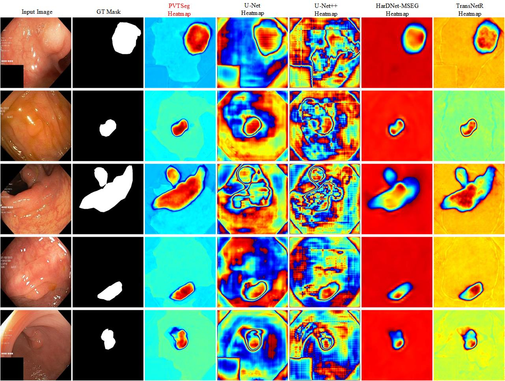
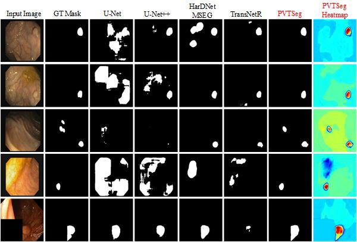
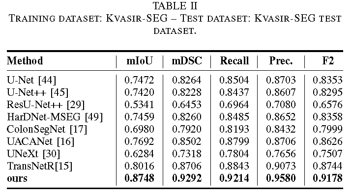
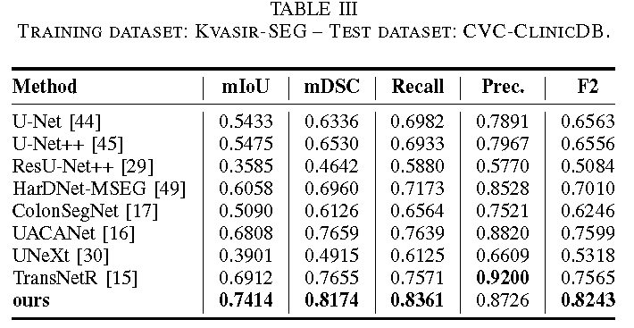
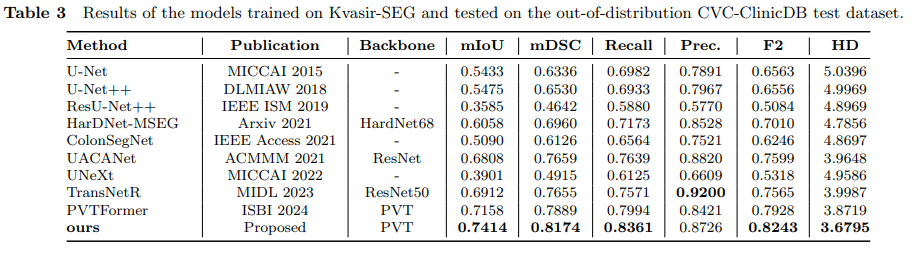

# datasets

download the datasets (1) [kvasir-seg](https://pan.baidu.com/s/1lDjPQnuJxmUi5TPcc2GFCg?pwd=q9jm ), (2) [CVC-ClinicDB](https://pan.baidu.com/s/1Y-N0-6knQu8st8hJIvqSNg?pwd=fhov ) and (3) [PolypGen](https://pan.baidu.com/s/1JCGqy1Kq_J6aoo5289P7aA?pwd=aukk ). 

---

1. more information about kvasir-seg refers to the paper [D. Jha, P. H. Smedsrud, M. A. Riegler, P. Halvorsen, T. De Lange,  D. Johansen, and H. D. Johansen, Kvasir-seg: A segmented polyp  dataset, in MultiMedia Modeling: 26th International Conference, MMM  2020, Daejeon, South Korea, January 5–8, 2020, Proceedings, Part II  26. Springer, 2020, pp. 451–462]

2. more information about CVC-ClinicDB refers to the paper [J. Bernal, F. J. Sanchez, G. Fernandez-Esparrach, D. Gil, C. Rodrıguez, and F. Vilarino, Wm-dova maps for accurate polyp highlighting in  colonoscopy: Validation vs. saliency maps from physicians, Computerized medical imaging and graphics, vol. 43, pp. 99–111, 2015]

3. more information about PolypGen (2021_MultiCenterData_v3) refers to the paper [S. Ali, D. Jha, N. Ghatwary, S. Realdon, R. Cannizzaro, O. E. Salem,  D. Lamarque, C. Daul, M. A. Riegler, K. V. Anonsen, et al., A multicentre polyp detection and segmentation dataset for generalisability  assessment, Scientific Data, vol. 10, no. 1, p. 75, 2023]

# usage

We implemented the model using the Pytorch framework on an NVIDIA A100 GPU system. The Adam optimizer was used with a learning rate of 1e-4, and the batch size was set to 16, with a maximum of 500 epochs. Specifically,

# results of PVTSeg

We provide pth of our PVTSeg trained on kvasir-seg；
(link: https://pan.baidu.com/s/13shptjoT0MhKa1mCm9BY9g code: 7g5w) 

1.heatmaps of each methods

2.Qualitative results comparison along with the heatmap on the CVC-ClinicDB.

3.qualitative results comparison along with the heatmap on the Kvasir-SEG.

4.The statistic results of the compared methods on kvasir-seg, CVC-ClinicDB and PolypGen (PolypGen2021_MultiCenterData_v3)s are as follows

# 
