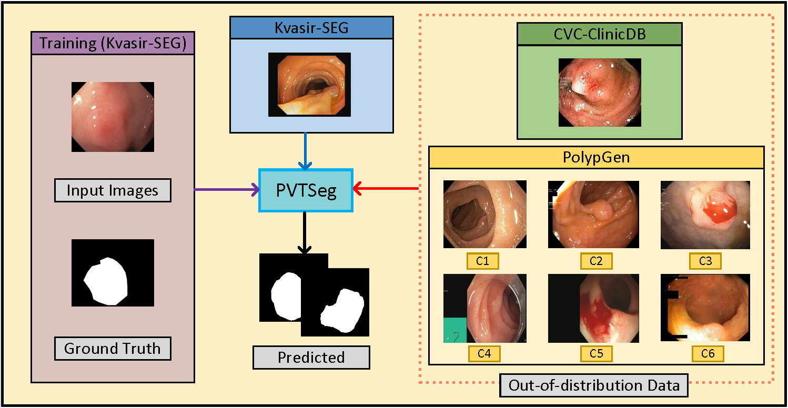
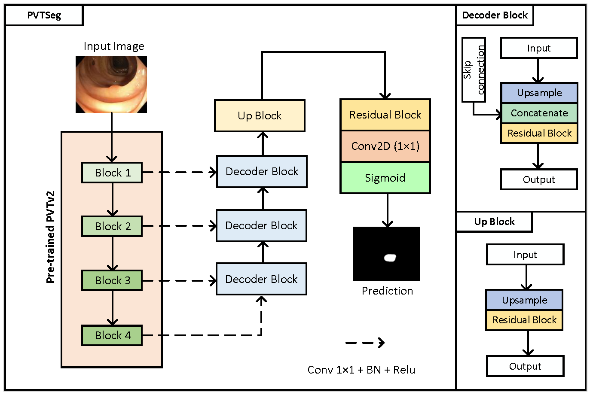
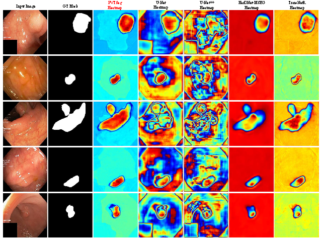
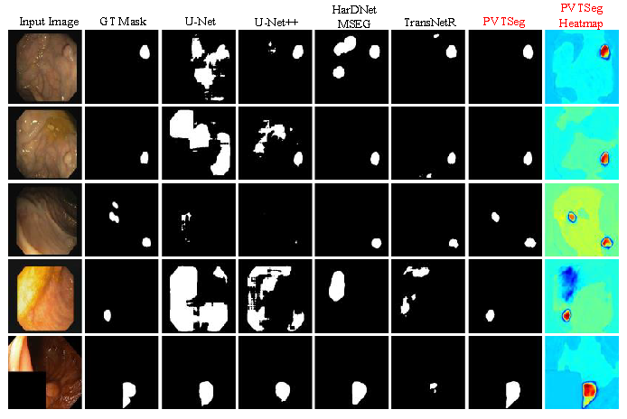
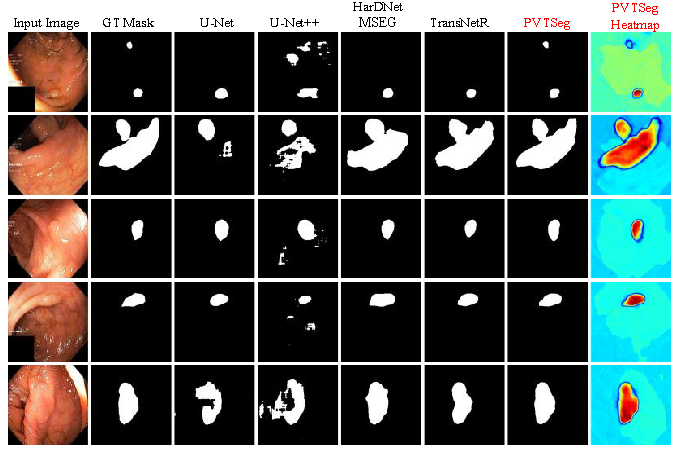

# PVTSeg: A Simple and  Effective Real-Time PVT-based Polyp Segmentor

PVTSeg is an encoder decoder network which can be used for efficient biomedical image segmentation for both in-distribution and out-of-distribution datasets.

## In-distribution and Out-of-distributuion dataset

*Figure 1. The proposed work conducted both in-distribution and out-of-distribution validation process. C1 to C6 represent the different centers data present in PolypGen dataset width=50% height=50%*

## PVTSeg

*Figure 2. Overview of the PVTSeg framework.*

## datasets

download the datasets (1) [kvasir-seg](https://pan.baidu.com/s/1lDjPQnuJxmUi5TPcc2GFCg?pwd=q9jm ), (2) [CVC-ClinicDB](https://pan.baidu.com/s/1Y-N0-6knQu8st8hJIvqSNg?pwd=fhov ) and (3) [PolypGen](https://pan.baidu.com/s/1JCGqy1Kq_J6aoo5289P7aA?pwd=aukk ). 

---

1. more information about kvasir-seg refers to the paper [D. Jha, P. H. Smedsrud, M. A. Riegler, P. Halvorsen, T. De Lange,  D. Johansen, and H. D. Johansen, Kvasir-seg: A segmented polyp  dataset, in MultiMedia Modeling: 26th International Conference, MMM  2020, Daejeon, South Korea, January 5–8, 2020, Proceedings, Part II  26. Springer, 2020, pp. 451–462]

2. more information about CVC-ClinicDB refers to the paper [J. Bernal, F. J. Sanchez, G. Fernandez-Esparrach, D. Gil, C. Rodrıguez, and F. Vilarino, Wm-dova maps for accurate polyp highlighting in  colonoscopy: Validation vs. saliency maps from physicians, Computerized medical imaging and graphics, vol. 43, pp. 99–111, 2015]

3. more information about PolypGen (PolypGen2021_MultiCenterData_v3) refers to the paper [S. Ali, D. Jha, N. Ghatwary, S. Realdon, R. Cannizzaro, O. E. Salem,  D. Lamarque, C. Daul, M. A. Riegler, K. V. Anonsen, et al., A multicentre polyp detection and segmentation dataset for generalisability  assessment, Scientific Data, vol. 10, no. 1, p. 75, 2023]

## trained model

We provide pth of our PVTSeg trained on kvasir-seg
(link: https://pan.baidu.com/s/1KQ-fBvKLxoTFmbbo03OA2A?pwd=c411)

## results (Qualitative results)

*Figure 4. The heatmap display the intensity of the regions of interest predicted by each model. Through this comparative visualization, we can intuitively evaluate the accuracy and detail performance of different models in segmentation tasks.*

---

*Figure 5. Qualitative results comparison along with the heatmap of PVTSeg on the CVC-ClinicDB.*

---

*Figure 6. Qualitative results comparison along with the heatmap  of PVTSeg on the Kvasir-SEG.*

## results (Qualitative results)

# 
